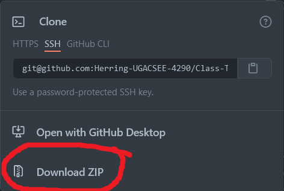

# Class-Toolchain

**Note: iverilog/GTKWave are not included in the Linux folder of this repository, as the package is located in a debian/launchpad/ppa repository, and can be downloaded with specific versions, as instructed in the Getting Started guide**

A copy of the software/toolchain for the class. Installation instructions for this software can be found in the Getting Started guide on ELC.

## **This repository uses [Git LFS](https://git-lfs.github.com/), do not attempt to clone it with https or SSH unless you have Git LFS installed. Instead, use the 'Download Zip' option as illustrated below:**

first, click the `code` button above:

Then, in the dropdown menu, select `download Zip`:

